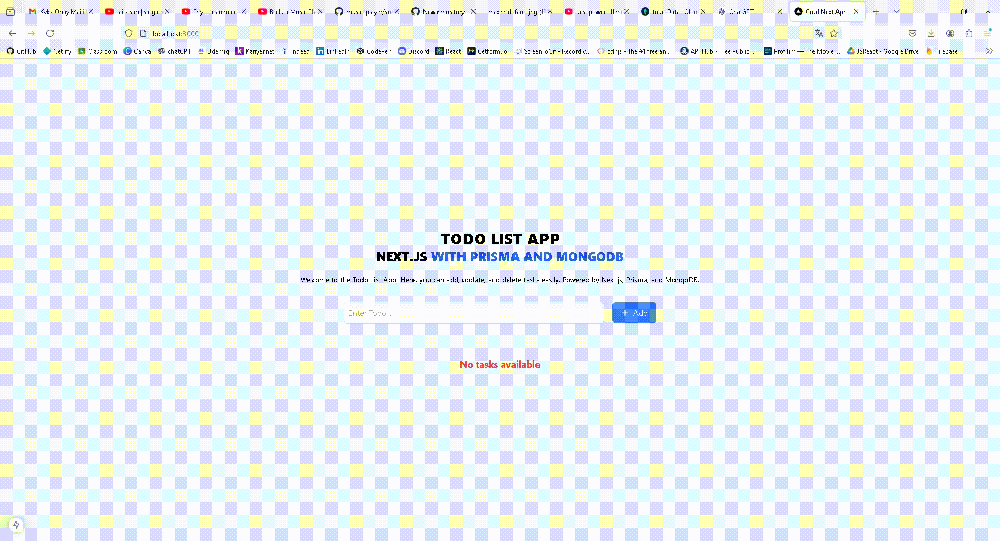

# Todo List Uygulaması - Next.js, Prisma ve MongoDB ile

Bu, **Next.js**, **Prisma** ve **MongoDB** kullanılarak oluşturulmuş bir **Todo List Uygulaması**'dır. Uygulama, kullanıcıların görev eklemesine, düzenlemesine, silmesine ve tamamlanmış olarak işaretlemesine olanak tanır.

### Özellikler

- **Görevleri Listeleme**: Kullanıcılar mevcut görevlerini görüntüleyebilir.
- **Yeni Görev Ekleme**: Yeni bir görev eklenebilir.
- **Görev Düzenleme**: Var olan görevlerin başlığı değiştirilebilir.
- **Görev Silme**: Gereksiz görevler kaldırılabilir.
- **Responsive Tasarım**: Mobil cihazlar ve masaüstü cihazlar için uyumludur.

## Kullanılan Teknolojiler

- **Next.js**: React tabanlı modern web uygulamaları geliştirme framework'ü.
- **Prisma**: ORM aracı olarak kullanıldı.
- **MongoDB**: Veritabanı olarak tercih edildi.
- **Axios**: API çağrıları için.
- **React Icons**: İkonlar için kullanıldı.
- **Tailwind CSS**: Kullanıcı arayüzünü şekillendirmek için.

---

## Kurulum

### 1. Repositoriyi Klonlayın

```bash
git clone https://github.com/dursunaydin1/crud-nextjs-app.git
```

### 2. Bağımlılıkları Yükleyin

```bash
cd crud-next-app
npm install
```

### 3. MongoDb'yi Ayarlayın

MongoDB bağlantınızı güvenli bir şekilde .env dosyasına ekleyin:

```bash
DATABASE_URL="mongodb+srv://<your_mongo_user>:<your_mongo_password>@todo.kkcvu.mongodb.net/todo?retryWrites=true&w=majority"
```

### 4. Prisma'yi Ayarlayın

```bash
DATABASE_URL="mongodb+srv://<your_mongo_user>:<your_mongo_password>@cluster0.mongodb.net/todo_db?retryWrites=true&w=majority"
```

### 5. Projeyi Çalıştırma

```bash
npm run dev
```

## Proje Demo

Projenin canlı demo sürümüne aşağıdaki bağlantıdan ulaşabilirsiniz:

- [Demo Linki - Vercel](https://crud-nextjs-app.vercel.app/)

Aşağıda uygulamanın kullanımını gösteren bir GIF yer almaktadır:


